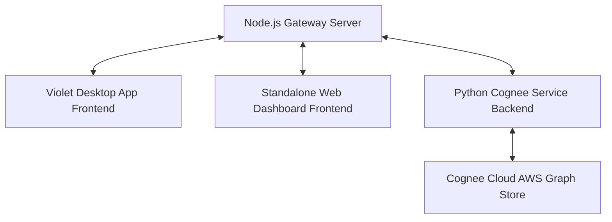

# Violet: Next-Gen AI Assistant Powered by Cognee Cloud

Violet is a production-ready, hyper-personalized AI assistant featuring persistent memory and proactive agentic capabilities. Built with a hybrid-cloud architecture, Violet delegates complex knowledge-graph extraction and retrieval to **Cognee Cloud**, achieving fast and rate-limit-free performance.

---

## Architecture Overview

Violet is built as a centralized tree-based ecosystem where the Node.js Gateway Server acts as the core coordinator:



- **Violet Desktop App (Frontend):** A premium desktop chat interface that connects to the server and handles real-time message streaming.
- **Standalone Web Dashboard (Frontend):** A secondary React + Vite web dashboard for managing user accounts, sign-ups, and chat threads directly in the browser.
- **Gateway (Node.js/Express):** The central hub of the application. Manages user authentication, PostgreSQL database storage, and forwards real-time messages over WebSockets between all frontends and backends.
- **Python Cognee Service (Backend):** Orchestrates intent routing, coordinates agentic tools, and serves as the bridge to Cognee Cloud.
- **Cognee Cloud:** Acts as the brain of the assistant. By offloading text document ingestion to Cognee Cloud's AWS engine, we construct complex semantic memory graphs asynchronously, completely bypassing local API rate-limit bottlenecks.

---

## How We Built It & Challenges Faced

### The API Rate-Limit Trap (The Local Graph Challenge)
Initially, we attempted to parse local workspaces and build semantic knowledge graphs locally. However, doing parallel parsing, tokenization, and embedding generation locally hammered our LLM API key. We hit immediate `HTTP 429` (Too Many Requests) rate limit restrictions. 

### The Solution: Transitioning to Cognee Cloud
To resolve the API bottlenecks, we pivoted to a hybrid architecture leveraging **Cognee Cloud**. 
- Whenever a user requests Violet to "remember" or ingest a workspace, we extract the text locally and stream it asynchronously to Cognee Cloud via `cognee.remember()`.
- Cognee Cloud processes the text, performs entity extraction, and updates the knowledge graph on their AWS infrastructure.
- The local Python service requests a recall search via `cognee.recall()` when a user asks a question, which returns `GRAPH_COMPLETION` semantic summaries.
- This lets us run all conversational interactions in a single-pass stream, bypassing local token processing bottlenecks and keeping the UI fast and responsive.

### Designing Streamed Tool Calling
We built a custom two-pass agentic execution pipeline. In the first pass, we check if the user query needs to execute local tools (creating files, deleting files, fetching system time, or performing web searches). The backend executes the tools and feeds the results back to the LLM. In the second pass, the LLM streams the final conversational text back to the frontend, maintaining a smooth, real-time typing effect.

---

## Desktop Build & Installation (.exe)

Violet includes a pre-configured packaging pipeline using `electron-builder` to compile the desktop client into a standalone Windows executable and installer:

- **Build Command:** Run `npm run electron:build` inside the `electron/` directory.
- **Standalone Installer:** Located at `electron/release/Violet Setup 0.0.0.exe` (Double-click to install).
- **Portable Unpacked Executable:** Located at `electron/release/win-unpacked/Violet.exe` (Run directly to launch without installation).

*Note: The Windows installer and binary are packaged with custom multi-resolution `.ico` icon assets generated from Violet's official branding.*

---

## Configuration Requirements (.env)

Set up the `.env` files in their respective folders as described below:

### 1. Violet Desktop App & Standalone Webpage (`webpage/.env`)

Configure the location of the running Node.js Gateway.

```ini
VITE_BACKEND_HOST="http://localhost:3000"
```

### 2. Python Cognee Service (`python_service/.env`)

Configure the local LLM routing parameters and internal Cognee setups.

```ini
# LLM Provider Configuration (OpenAI compatible)
LLM_PROVIDER="gemini"
LLM_MODEL="gemini/gemini-2.5-flash"
GEMINI_API_KEY="your-gemini-api-key"
LLM_API_KEY="your-gemini-api-key"

# Embedding Configurations
EMBEDDING_PROVIDER="gemini"
EMBEDDING_MODEL="gemini/text-embedding-004"
EMBEDDING_DIMENSIONS="768"

# Security & Access
ENABLE_BACKEND_ACCESS_CONTROL=false
```

*Note: The tenant database credentials (Cognee serve endpoints and API keys) are connected inside the `main.py` lifecycle startup event.*

### 3. Node.js Gateway Server (`server/.env`)

Configure the gateway routing, database configuration, and OTP email dispatch.

```ini
# Gateway Server Port
PORT=3000

# PostgreSQL Configuration
PG_USER=postgres
PG_PASSWORD=password
PG_HOST=localhost
PG_PORT=5432
PG_DATABASE=GoldFish

# Authentication
JWT_SECRET=your-jwt-signing-secret

# OTP / Verification Email SMTP Config
EMAIL=your-sender-email@gmail.com
APP_EMAIL_PASSWORD=your-app-specific-email-password
```

---

## Core Features

1. **Persistent Memory Graph (Cognee Cloud):** Violet remembers documents and details across multiple conversation threads using AWS-backed graph completions.
2. **Proactive Agentic Tools:** Violet can run live Web Searches, fetch the local System Clock, and dynamically Create or Delete files in your active workspace directory.
3. **Decisive Personality:** Violet acts as a true executive assistant, giving clear, concrete choices and avoiding boilerplate AI disclaimers.

