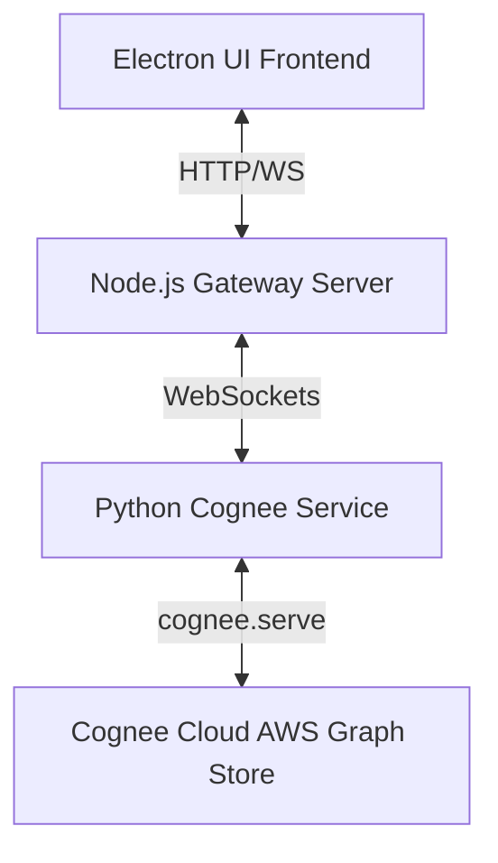

# Violet: Next-Gen AI Assistant Powered by Cognee Cloud

Violet is a production-ready, hyper-personalized AI assistant featuring persistent memory and proactive agentic capabilities. Built with a hybrid-cloud architecture, Violet delegates complex knowledge-graph extraction and retrieval to **Cognee Cloud**, achieving fast and rate-limit-free performance.

---

## Architecture Overview



- **Frontend (Electron/React):** A premium desktop chat interface that connects to the server and handles real-time message streaming.
- **Gateway (Node.js/Express):** Manages user authentication, PostgreSQL databases, and forwards WebSocket messages.
- **Python Cognee Service (FastAPI):** Orchestrates intent routing, coordinates agentic tools, and serves as the bridge to Cognee Cloud.
- **Cognee Cloud:** Acts as the brain of the assistant. By offloading text document ingestion to Cognee Cloud's AWS engine, we construct complex semantic memory graphs asynchronously, completely bypassing local API rate-limit bottlenecks.

---

## Configuration Requirements (.env)

The project consists of two key configuration zones. Please set up the `.env` files in their respective folders as described below:

### 1. Python Cognee Service (`python_service/.env`)

Configure the local LLM routing parameters and internal Cognee setups.

```ini
# LLM Provider Configuration (OpenAI compatible)
LLM_PROVIDER="gemini"
LLM_MODEL="gemini/gemini-2.5-flash"
GEMINI_API_KEY="your-gemini-api-key"
LLM_API_KEY="your-gemini-api-key"

# Embedding Configurations
EMBEDDING_PROVIDER="gemini"
EMBEDDING_MODEL="gemini/text-embedding-004"
EMBEDDING_DIMENSIONS="768"

# Security & Access
ENABLE_BACKEND_ACCESS_CONTROL=false
```

*Note: The tenant database credentials (Cognee serve endpoints and API keys) are connected inside the `main.py` lifecycle startup event.*

### 2. Node.js Gateway Server (`server/.env`)

Configure the gateway routing, database configuration, and OTP email dispatch.

```ini
# Gateway Server Port
PORT=3000

# PostgreSQL Configuration
PG_USER=postgres
PG_PASSWORD=password
PG_HOST=localhost
PG_PORT=5432
PG_DATABASE=GoldFish

# Authentication
JWT_SECRET=your-jwt-signing-secret

# OTP / Verification Email SMTP Config
EMAIL=your-sender-email@gmail.com
APP_EMAIL_PASSWORD=your-app-specific-email-password
```

---

## Core Features

1. **Persistent Memory Graph (Cognee Cloud):** Violet remembers documents and details across multiple conversation threads using AWS-backed graph completions.
2. **Proactive Agentic Tools:** Violet can run live Web Searches, fetch the local System Clock, and dynamically Create or Delete files in your active workspace directory.
3. **Decisive Personality:** Violet acts as a true executive assistant, giving clear, concrete choices and avoiding boilerplate AI disclaimers.
